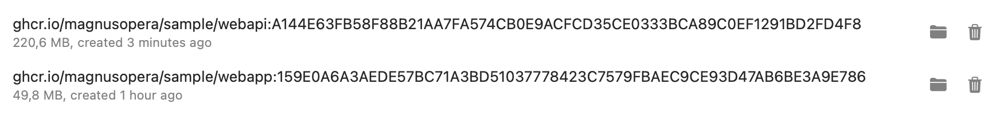

<a href="https://terrabuild.io?utm_campaign=magnusopera-terrabuild-playground-github-repo&utm_source=github.com&utm_medium=top-logo" title="Terrabuild - Monorepo build tool">
    
</a>

# Terrabuild Playground Repository
This is a repository where you can quickly try [Terrabuild](https://terrabuild.io). There you will find:
* a .net library project (src/libs/cslib)
* a .net webapi project (src/apps/webapi)
* a typescript (transpiled to js) library (src/libs/tslib)
* a vuejs project (src/apps/webapp)

### Dependencies
* Project `src/apps/webapi` has a dependency on `src/libs/cslib`
* Project `src/apps/webapp` has a dependency on `src/libs/tslib`
* Project `src/deploy` has dependencies on `src/apps/webapi` and `src/apps/webapp`


### Targets
There are several targets declared in this workspace:
* build: just build projects - this is used on developer environment (local build)
* dist: build and publish docker images - this is used on CI but can be used on dev env to check everything is running fine (images stay local if not building on CI)
* plan/deploy: targets to check terraform and deploy. Used in gated deployment on CI.


This corresponds to this global build graph:


# HOW TO
Before using this repository, please install [Terrabuild](https://terrabuild.io/docs/getting-started/) and [Docker](https://docs.docker.com/desktop/install/mac-install/). If you are running on macOS, you are advised to use [OrbStack](https://docs.orbstack.dev/install) as it is much faster than Docker Desktop.

Then you can clone this repository:
```
git clone https://github.com/MagnusOpera/terrabuild-playground.git
cd terrabuild-playground
```

### Build
You can then build everything using:
```
terrabuild run build
```
This will build applications and create docker images. Note first run needs to download docker images - this can take some time. This will be much faster next time!

You will then have a similar output:


Docker images are built as well (here in OrbStack) - note tags can differ as this repository evolves:


### Deploy
You can also deploy using Terraform (it's a fake local deployment). You can check deployment in file `src/deploy/deploy.log` and verify it's been updated if something change.
```
terrabuild run deploy
```

Notice that since targets are cached, build is really fast. You will then have a similar output:


# Key takeaways
* Building and deploying the project only required few deployment on local machine (Terrabuild and Docker).
* Terrabuild takes care of optimizating build graph where applicable so you don't have to.
* Development environments can be normalized without needing complex local configuration.
* Target executions can be faster when configured to use the global cache.
* Terrabuild can manage both build and deployment requirements.
